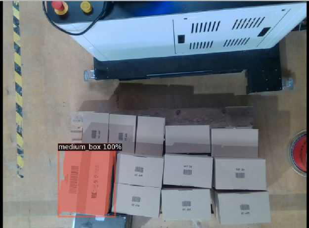
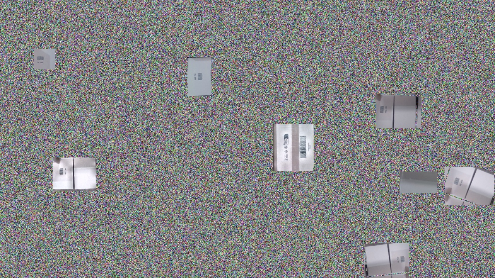
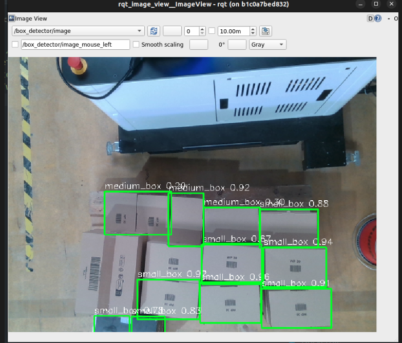
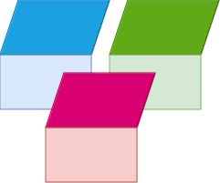
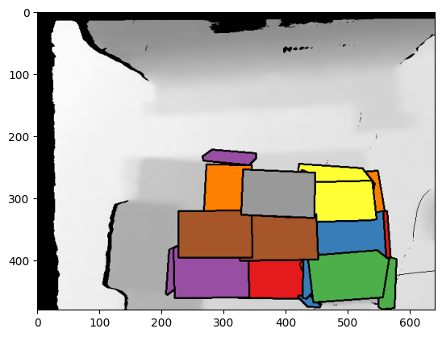
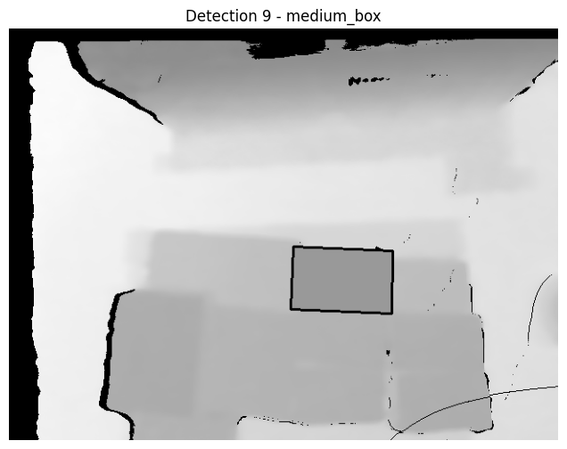
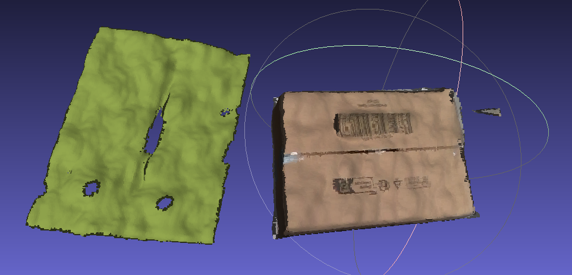
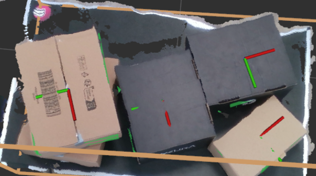
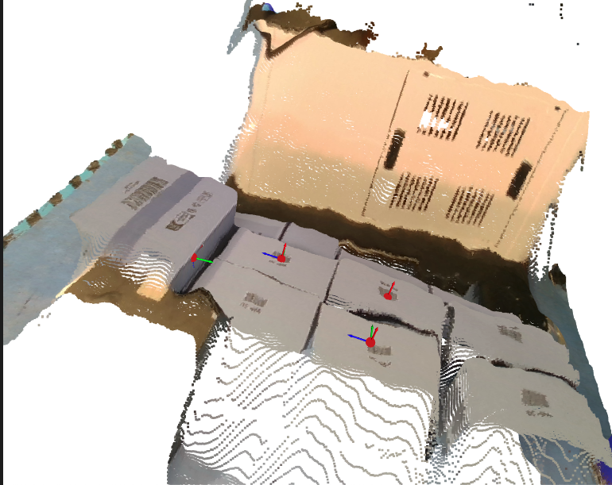
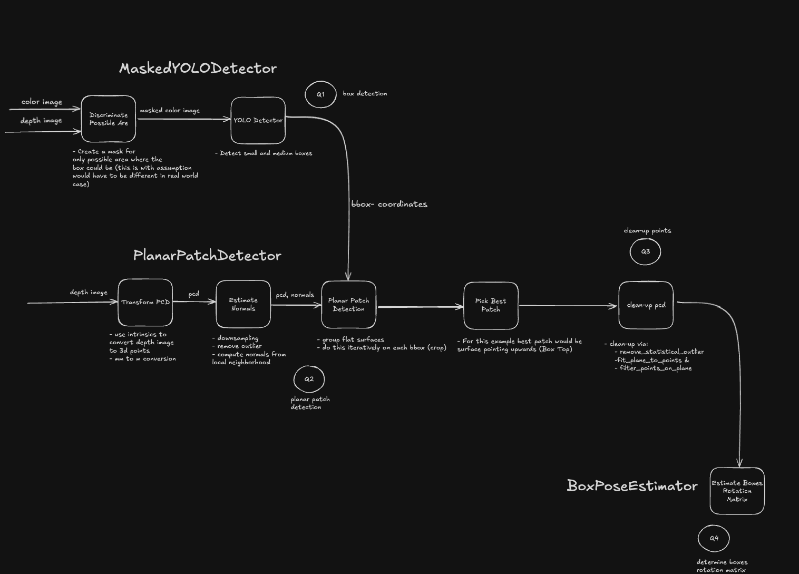

# smart_palletizer

[[_TOC_]]

## Introduction

Welcome to the [NEURA robotics](https://neura-robotics.com) Smart Palletizer challenge, the goal of this challenge is to assess your knowledge regarding various software development topics.

## Instructions

You are free to use **Python or C++**, preferably with Robotics Operating System ([**ROS**](https://www.ros.org)) either ROS1 or ROS2.

Please explain your **methodology** into solving the challenging tasks either via updating this readme file or via creating a separate Markdown file.

> Please note that using [ChatGPT](https://chatgpt.com) is OK as long as you understand what you copy from there!.

## Tasks

Tasks have various complexity, optimal thing is to solve them all, however if you didn't solve some tasks please submit your code.

> Tasks are not interdependent.

### Input


Data are provided in two formats:
1. ROSBAG:

    If you use **ROS**, please download and use the [ROS bag](https://drive.google.com/file/d/1ldM94Tz_I5NytLaQB8AydF_pxDG7EOkd/view?usp=sharing) which contains data needed to achieve the task.
2. RAW data:

    the [data](./data/) folder, there you can find two types of boxes:
    1. **small box**: dimensions: [0.340, 0.250, 0.095] in meters.
    2. **medium box**: dimensions: [0.255, 0.155, 0.100] in meters (only one box in the left bottom corner is visible).

    Provided data includes color/depth images in addition to box meshes, and other forms of data that is useful to solve the tasks.


### 1. 2D boxes detection

---

The goal of this task is to detect and small box, and medium box from color/depth images:

Note that you are free to use classical detection methods, or even [**synthetic**](https://github.com/DLR-RM/BlenderProc) data generated using the provided mesh files to achieve this task.

Here is an example of detected medium box:


---

### My Solution for 2D Box Detection
The pipeline involves synthetic data generation, YOLO model training, and real-time box detection using ROS.

---

### Data Preparation

- Initially, BlenderProc was explored to generate synthetic training data. However, due to difficulty in producing a usable dataset, a different approach was taken.
- Instead, real 2D and 3D image samples from `data/small_box` and `data/medium_box` were used.
- Templates were created by extracting the box regions from these real images.
- Synthetic training images were then generated by placing the templates onto randomly chosen background images at random positions.
- This approach provided a diverse training set that simulates real-world clutter and variation.

The data generation process can be reviewed in the notebook:
`notebooks/A1_prepare_training_yolo.ipynb`

Example of synthetic training data:


---

### YOLOv8 Model Training

- The synthetic dataset was used to train a YOLOv8 object detection model.
- The training process included:
  - Converting the dataset into YOLO format
  - Configuring and launching training with appropriate parameters

The training procedure is detailed in:
`notebooks/A1_Train_YOLO_Model.ipynb`

---

### Detection Pipeline (2D and 3D)

- The trained YOLOv8 model was then applied to detect boxes in real 2D RGB images.
- In addition to 2D detection, the corresponding depth images were processed to filter out regions unlikely to contain boxes, based on depth thresholding. This helps narrow down the 3D search space for planar surfaces.
- This preprocessing step assumes that boxes lie on relatively flat surfaces (such as a pallet or table). While this assumption holds in many cases, it may need to be adjusted depending on the deployment environment.

The detection results using the YOLO model can be visualized in the notebook:
`notebooks/A1_run_yolo_detector.ipynb`

Example of YOLO detection output:



### 2. Planar patches detection (3D)

---

The goal of this task is to detect planar surfaces in the point cloud of the boxes that might represent any of box sides and group them according to the box that they belong to.



---

### My Solution for Planar Patch Detection

- The Open3D library was used to detect planar patches from point clouds generated using depth images.
- The detection pipeline includes:
  - Converting depth images into point clouds
  - Segmenting planar surfaces using RANSAC and normal-based filtering
  - Selecting the largest or most relevant planar patches based on area and orientation
- These steps allow us to isolate the top surfaces of boxes, which are crucial for pose estimation.

The implementation details and visualization results can be found in:
`notebooks/A2_run_patch_detector.ipynb`

Example visualizations of detected planar patches:



---

### 3. Point Cloud post processing

---

Raw Point Clouds provided in the data folder are noisy, the goal of this task is to post-process the pointcloud to get a clean pointcloud for further processing, without jeopardizing the dimensions of the box too much.

---

### My Solution for Point Cloud Cleaning

- The Open3D library was used to clean the raw point clouds derived from the depth images.
- The cleaning process consists of several key steps:
  - **Voxel downsampling** to reduce the number of points while preserving structure
  - **Statistical outlier removal** to eliminate sparse noise from the cloud
  - **RANSAC plane fitting** to detect dominant planes and filter out distant points that do not belong to the surface

These steps significantly improve the quality and usability of the point clouds for downstream tasks like pose estimation.

All steps are demonstrated in:
`notebooks/A3_clean_point_clouds.ipynb`

---

Example of a cleaned point cloud:



### 4. Box Poses Estimation

---

This task aims to estimate 6D poses (Translation, Orientation) of the boxes in the scene:



---

### My Solution for Pose Estimation

- A solution was implemented in `notebooks/A4_estimate_box_pose.ipynb`.
- Since some planes (e.g., sides or fronts) were often noisy or missing, the estimation is based solely on the **top planar surface** of each detected box.
- Given the **known dimensions** of each box, the algorithm determines whether a planar patch likely belongs to the top, side, or front face.
- Using the **surface normal** of the plane, one axis of the box is derived. The orientation is then inferred by assigning and rotating the axes based on the identified face type (top, front, or side).
- The **translation** is taken as the center of the fitted plane.
- The final 6D pose in the **world frame** is computed using the camera-to-world **extrinsics matrix**.


Pose estimation example:


---

### Pipeline Overview

The entire pipeline is structured into three main components:
- `MaskedYOLODetector`: detects boxes in 2D using a masked YOLO model
- `PlanarPatchDetector`: extracts and filters top planar patches in 3D
- `BoxPoseEstimator`: estimates the full 6D pose (translation + rotation)

Pipeline diagram:


---

## Evaluation

1. **Methodology** correctness into solving the challenge, please explain your efforts into solving the challenge rather than sending code only.
1. **Code validity** your code for the submitted tasks has to compile on our machines, hence we ask you kindly to provide clear instructions on how to compile/run your code, please don't forget to mention depndency packages with their versions to reproduce your steps.
3. **Code Quality** we provide empty templates e.g. `.gitignore`, `docker`, `CI`, Documentation, they are **optional**, keep in mind that best practices are appreciated and can add **extra points** to your submission.
4. **Visualization** it would be nice if you can provide visual results of what you have done: images, videos, statistics to represent your results.
5. **ChatGPT / Gemini** are useful tools if you use them wisely, however original work / ideas are always regarded with higher appreciation and gain more points, we remind you that we might fail the challenge if you misuse them (*e.g. copy paste code without understanding*).

## Documentation

Documenting your code is appreciated as you can explain the functionality in standardized way, hence we provide you with a Python template to compile your [documented functions/classes](https://www.geeksforgeeks.org/python-docstrings):

```sh
sudo apt-get install texlive-latex-base texlive-fonts-recommended texlive-fonts-extra texlive-latex-extra latexmk
#
cd smart_palletizer/docs
pip3 install -U pip
pip3 install -r requirements.txt
make clean && sphinx-apidoc -f -o source ../src/smart_palletizer
make html SPHINXBUILD="python3 /opt/conda/envs/rosenv/bin/sphinx-build"
##----------
## Example:
##----------
# make html SPHINXBUILD="python3 $HOME/venv/bin/sphinx-build"
```
---

If you are using C++, then please refer to [Doxygen](https://www.doxygen.nl)

### My Solution to Documentation

Documentation for the implementation is provided in the `docs/` folder.
The full documentation is also available on GitHub.


---

## My Solution to ROS Implementation

After experimenting in the notebook, I prepared ROS nodes to run the implementation in a ROS environment. To launch the system, use the following commands in separate terminals:

```bash
# Terminal 1: Play the ROS bag with simulated time
rosbag play <path_to_rosbag> --loop --clock

# Terminal 2: Run the box detector node
roslaunch smart_palletizer box_detector.launch

# Terminal 3: Run the planar patch detector node
roslaunch smart_palletizer planar_patch_detector.launch

# Terminal 4: Run rqt_image_view to view detection and overlays
rqt_image_view

```

---
